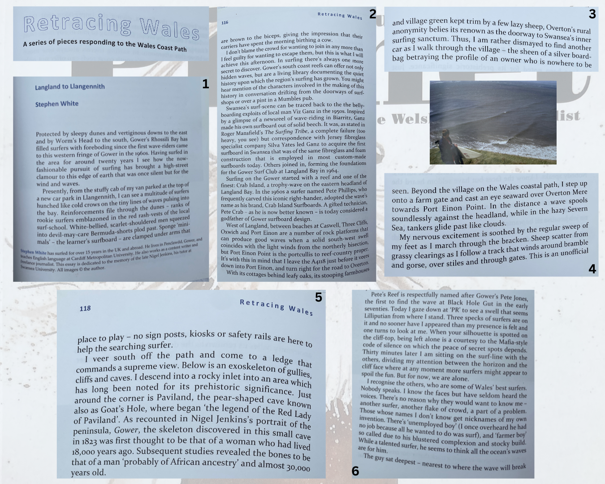
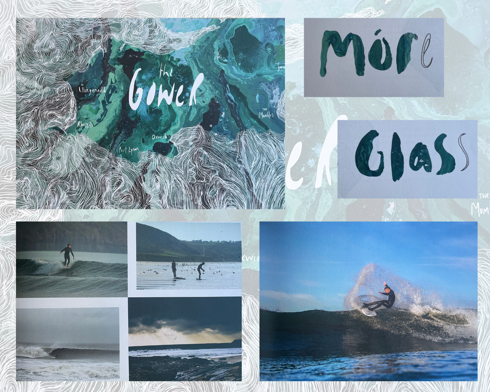
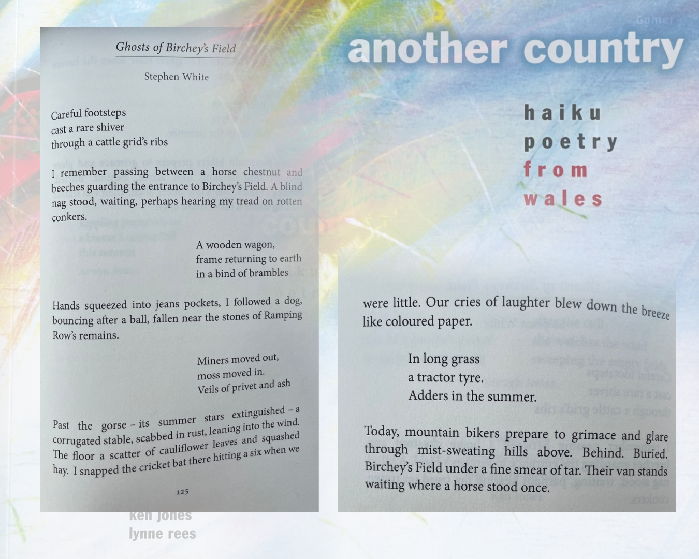
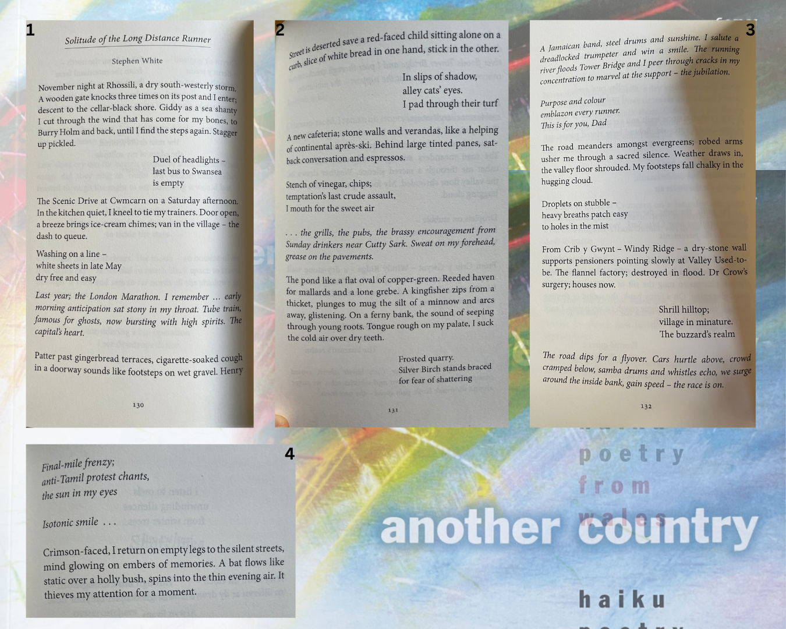
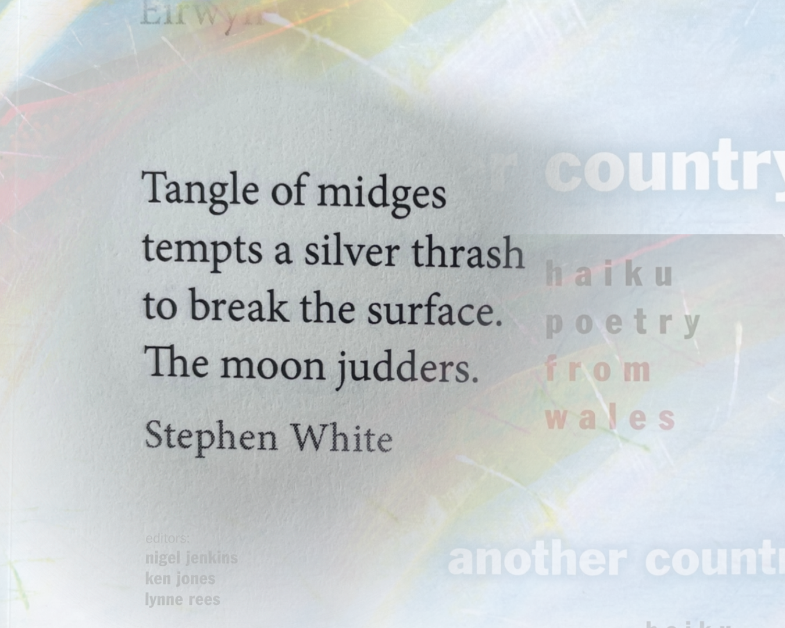

# Creative
Literature, poetry, and independent projects.

## Literature

### Essay: Footprints Through Sand and Stone
A creative nonfiction essay published in *[Planet](https://www.planetmagazine.org.uk/)*, the Welsh internationalist magazine of arts, literature and national affairs. 

The essay charts a surf exploration journey to a location on the south Gower section of the Wales Coast Path.

---

## Editorial, photography

### *The Gower (Móre Glass)*
*The Gower (Móre Glass)* brings together writing, photography and artwork inspired by the peninsula’s landscapes and seascapes. The project focuses on artists, makers and individuals whose lifestyles are shaped by Gower’s wild coastal environment.

I worked on the publication as an editor and contributor of prose and photography.

## Poetry 

### *Another Country – Haiku Poetry from Wales*
Haibun and haiku published in *Another Country: Haiku Poetry from Wales*. The anthology brings together work from poets across Wales exploring the traditional Japanese short-form through Welsh landscapes. The collection, published by Gomer Press and edited by Ken Jones, Nigel Jenkins and Lynne Rees, was the first national anthology dedicated to Welsh haiku poetry.

### Ghosts of Birchey's Field

### Solitude of the Long Distance Runner

### Stand-alone haiku

