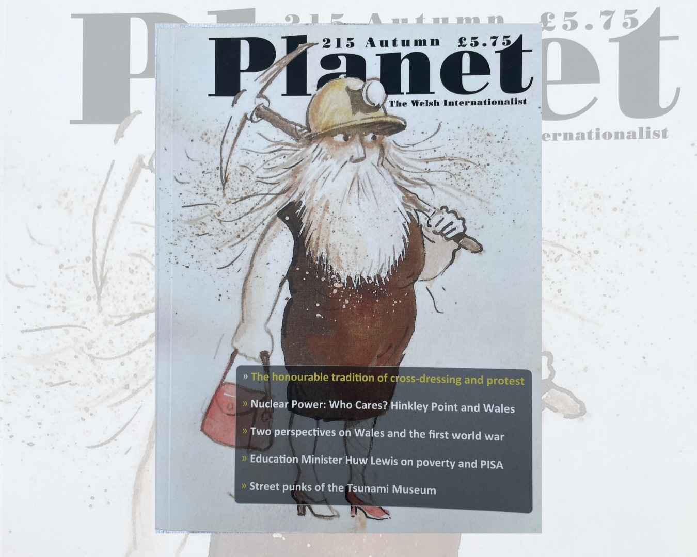
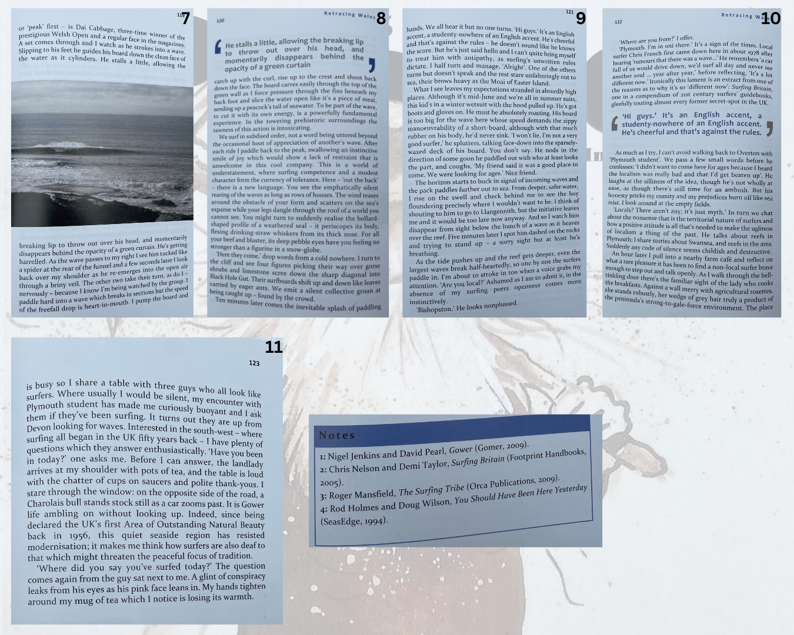
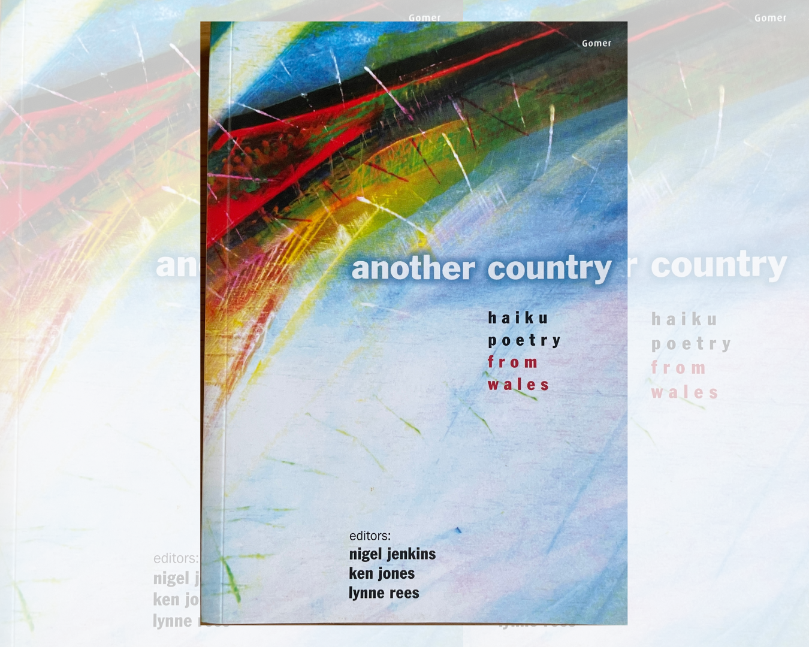

# Creative
Literature, poetry, and independent projects.

## Literature

### Essay: Footprints Through Sand and Stone
A creative nonfiction essay published in [Planet](https://www.planetmagazine.org.uk/), the Welsh internationalist magazine of arts, literature and national affairs. 

The essay charts a surf exploration journey to a location on the south Gower section of the Wales Coast Path.

## Editorial, photography

### The Gower (Móre Glass)
*The Gower (Móre Glass)* brings together writing, photography and artwork inspired by the peninsula’s landscapes and seascapes. The project focuses on artists, makers and individuals whose lifestyles are shaped by Gower’s wild coastal environment.

I worked on the publication as an editor and contributor, undertaking proofreading and editorial work while also contributing original prose and photography.

## Poetry 

### Another Country – Haiku Poetry from Wales
Three of haiku poems published in *Another Country: Haiku Poetry from Wales*, an anthology bringing together work from poets across Wales exploring the traditional Japanese short-form through Welsh landscapes and sensibilities. The collection, published by Gomer Press and edited by Ken Jones, Nigel Jenkins and Lynne Rees, was the first national anthology dedicated to Welsh haiku poetry.

### Ghosts of Birchey's Field

Ghosts.png

### Solitude of the Long Distance Runner

Solitude.png
